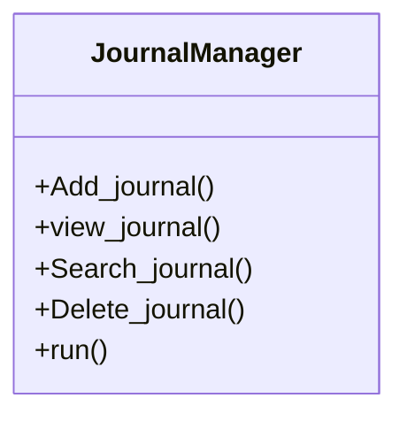
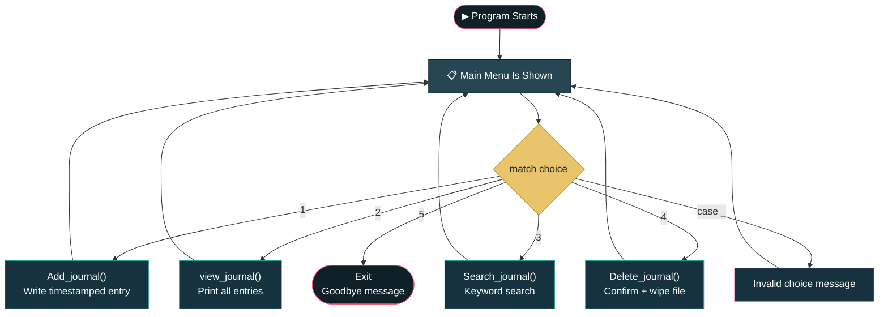

<div align="center">

```
     ██╗ ██████╗ ██╗   ██╗██████╗ ███╗   ██╗ █████╗ ██╗
     ██║██╔═══██╗██║   ██║██╔══██╗████╗  ██║██╔══██╗██║
     ██║██║   ██║██║   ██║██████╔╝██╔██╗ ██║███████║██║
██   ██║██║   ██║██║   ██║██╔══██╗██║╚██╗██║██╔══██║██║
╚█████╔╝╚██████╔╝╚██████╔╝██║  ██║██║ ╚████║██║  ██║███████╗
 ╚════╝  ╚═════╝  ╚═════╝ ╚═╝  ╚═╝╚═╝  ╚═══╝╚═╝  ╚═╝╚══════╝

███╗   ███╗ █████╗ ███╗   ██╗ █████╗  ██████╗ ███████╗██████╗
████╗ ████║██╔══██╗████╗  ██║██╔══██╗██╔════╝ ██╔════╝██╔══██╗
██╔████╔██║███████║██╔██╗ ██║███████║██║  ███╗█████╗  ██████╔╝
██║╚██╔╝██║██╔══██║██║╚██╗██║██╔══██║██║   ██║██╔══╝  ██╔══██╗
██║ ╚═╝ ██║██║  ██║██║ ╚████║██║  ██║╚██████╔╝███████╗██║  ██║
╚═╝     ╚═╝╚═╝  ╚═╝╚═╝  ╚═══╝╚═╝  ╚═╝ ╚═════╝ ╚══════╝╚═╝  ╚═╝
```

[](https://git.io/typing-svg)


</div>

## 🧭 Table of Contents

[Overview](#-project-overview) • [Objective](#-objective) • [Class Design](#-class-design) • [Data Storage](#-data-storage) • [Methods Overview](#-methods-overview) • [Features](#-features) • [Flow](#-program-flow) • [Example Output](#-example-output) • [Video](#-video) • [Skills](#-skills-demonstrated) • [Known Behaviors](#-known-behaviors--notes) • [Getting Started](#-getting-started) • [Structure](#-project-structure) • [Tech Stack](#-tech-stack) • [Author](#-author)

---

## 📌 Project Overview

**Personal Journal Manager** is a menu-driven Python console program that lets a user **add, view, search, and delete** personal journal entries. Every entry is timestamped and appended to a plain text file (`journal.txt`), so the journal persists across sessions with zero external dependencies — no database, no setup, just Python's built-in `datetime`, `os`, and file I/O.

<div align="center">

| ➕ Add | 👀 View | 🔍 Search | 🗑️ Delete |
|:---:|:---:|:---:|:---:|
| Timestamped entry | Print all entries | Keyword match | Wipe `journal.txt` |

</div>

> Built as a **file-handling & exception-handling practice project.**
> *"One entry a day keeps forgetting away."*

---

## 🎯 Objective

Build a Journal Manager that uses Python's core file-handling toolkit — `open()`, append/read/write modes, and structured exception handling — to persist and manage user-written journal entries from a simple terminal menu.

Concepts demonstrated:

- **File I/O** across three modes: append (`"a"`), read (`"r"`), and overwrite (`"w"`)
- **Exception handling** with `try` / `except` covering `FileNotFoundError`, `FileExistsError`, and `PermissionError`
- **String processing** — splitting stored entries on blank lines and doing case-insensitive keyword search
- **`datetime`** to timestamp every entry with the exact date and time it was written
- **`os.path.exists()`** to safely check for the journal file before operating on it
- A **menu-driven UI** built with Python's `match` / `case` statement, wrapped in a `while True` loop

---

## 🧱 Class Design



Unlike a multi-level inheritance project, `JournalManager` is a single, self-contained class — every operation (add, view, search, delete) is a method on it, and `run()` drives the menu loop that calls them.

---

## 🗂️ Data Storage

All entries live in a single flat file, appended to and read from directly on disk:

```
journal.txt
```

Each entry is written in this format, with a blank line separating entries so they can be split and searched individually:

```
[2026-08-26 14:32:07]
Today was a good day. Finished the project early.

[2026-08-26 18:10:45]
Feeling reflective tonight.
```

---

## 🧩 Methods Overview

<div align="center">


</div>

| Method | Purpose |
|---|---|
| `Add_journal()` | Prompts for entry text, timestamps it, and appends it to `journal.txt` |
| `view_journal()` | Reads and prints the full contents of `journal.txt`, or a friendly "no entries" message if empty |
| `Search_journal()` | Prompts for a keyword, splits the file into individual entries, and prints every entry containing a case-insensitive match |
| `Delete_journal()` | Asks for `yes`/`no` confirmation, then clears `journal.txt` if it exists and has content |
| `run()` | Displays the main menu in a loop and routes the user's choice via `match` / `case` |

---

## ✨ Features

- Numbered **5-option main menu** that loops until the user exits
- **Add a New Entry:** captures free-text input and stamps it with the current date and time (`YYYY-MM-DD HH:MM:SS`)
- **View All Entries:** prints every stored entry in order, separated by a divider line
- **Search for an Entry:** case-insensitive keyword search across all entries, printing only the matches (and a "no match" message if none found)
- **Delete All Entries:** requires explicit `yes` confirmation before wiping the file, and gracefully reports "nothing to delete" if the journal is already empty or missing
- **Exit:** prints a goodbye message and breaks the loop
- Full exception handling around every file operation (`FileNotFoundError`, `FileExistsError`, `PermissionError`)
- Falls back to a friendly *"Invalid option"* message on any menu choice outside 1–5

---

## 🌊 Program Flow

<details open>
<summary><b>Click to collapse / expand the flow diagram</b></summary>



</details>

| Step | Stage | Description |
|:---:|---|---|
| 1 | **Show Menu** | Print the five main-menu options |
| 2 | **Take Choice** | Read the user's number and route it with `match choice:` |
| 3 | **Run Operation** | Add, view, search, or delete entries in `journal.txt` |
| 4 | **Handle Errors** | Any file-access issue is caught and printed instead of crashing |
| 5 | **Repeat** | Loop back to Step 1 unless the user chose `5` (Exit) |

---

## 🎬 Example Output

<details open>
<summary><b>▶ Add an entry, then view it</b></summary>

```
Welcome to personal Journal Manager!

Please select an option:

1. Add a New Entry
2. View All Entries
3. Search for an Entry
4. Delete All Entries
5. Exit

User Input: 1
Enter your journal entry: Started learning file handling in Python today.
Entry added successfully!

User Input: 2
Ouput (If a match is found):
Your Journal Entries:
--------------------------------------
[2026-08-26 14:32:07]
Started learning file handling in Python today.
```

</details>

<details open>
<summary><b>▶ Search for a keyword, then exit</b></summary>

```
User Input: 3
Enter a keyword or data to search: python
Output (If a match is found):
Matching Entries:
-------------------------------------
[2026-08-26 14:32:07]
Started learning file handling in Python today.
----------------------------------------

User Input: 5
Thank you for using Personal Journal Manager. Goodbye!
```

</details>

---

## 🎬 Video

Video Link :- https://drive.google.com/drive/folders/your-video-link-here

</div>

---

## 🎯 Skills Demonstrated

<div align="center">


</div>

- Reading and writing files in append, read, and overwrite modes
- Structured exception handling around every file operation
- Timestamping entries with `datetime.now().strftime()`
- Splitting and searching raw text data by blank-line-separated records
- Safely checking file existence with `os.path.exists()` before deleting
- Building a menu-driven console loop with Python's `match` / `case`

---

## 📝 Known Behaviors & Notes

A few honest notes for anyone reading or grading this code:

- **Menu input isn't validated for type:** `choice = int(input(...))` will raise a `ValueError` and crash the program if the user types a non-numeric value instead of showing a friendly error.
- **`FileExistsError` in read paths:** `view_journal()` and `Search_journal()` both catch `FileExistsError`, which can never actually be raised by `open(..., "r")` — it's a defensive leftover and doesn't affect normal behavior.
- **Search on an empty file still proceeds:** `Search_journal()` prints "No journal entries found" when the file is empty but doesn't `return` afterward, so it still attempts to split and search an empty string (harmless, just redundant).
- **Delete requires exact `"yes"`:** any other input, including `"y"` or `"Yes"`, is treated as a cancel.

---

## 🚀 Getting Started

### Prerequisites

- Python 3.10+ (for `match` / `case` support)
- No external libraries required

### Installation

```bash
git clone https://github.com/anghanshrey/file_operator.git
cd file_operator/file operator
```

### Usage

```bash
python file_operator.py
```

When it runs, type:
- `1` to add a new journal entry
- `2` to view all entries
- `3` to search entries by keyword
- `4` to delete all entries (with confirmation)
- `5` to exit the program

---

## 📁 Project Structure

```
file_operator/
└── file operator/
    ├── file_operator.py   # Main script
    └── journal.txt        # Journal data (created automatically)
README.md                  # Project documentation
```

---

## 🛠️ Tech Stack

- **Language:** Python 3
- **Concepts demonstrated:** file I/O, exception handling, `datetime`, `os.path`, string splitting/search, `match`/`case`, menu-driven CLI design

---

## 👤 Author

<div align="center">


**Shrey Anghan**
🔗 GitHub: [@anghanshrey](https://github.com/anghanshrey)


</div>
